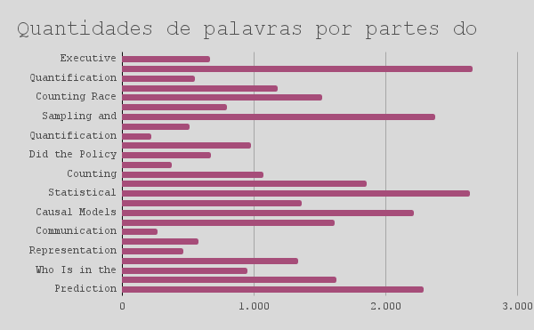
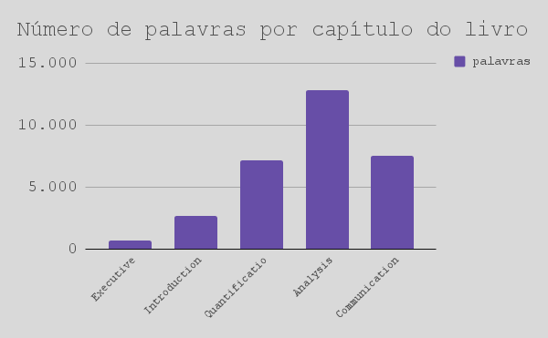

# Projeto de tradução do livro “Curious Journalist Guide to Data”

* **Autor**: Janathan Stray

* **Textuais**: Sumário Executivo, Introdução, 3 capítulos e Notas

* **Mediana por capítulo**: 1.126 palavras — 6.514 caracteres

* **Fontes**: [Livro no CJR](https://www.cjr.org/tow_center_reports/the_curious_journalists_guide_to_data.php#quantification) - [Livro em PDF](https://www.gitbook.com/book/towcenter/curious-journalist-s-guide-to-data/details)
	
* **Prazo tentativo**: 	28/02/2018    

* **Processo**: capítulos em português deverão ser colocados no branch *port*

* **Sugestão para iniciantes em Markdown**: [Dillinger](https://dillinger.io/)

___

| capítulo          | subtítulo                           | parte | palavras | caracteres |
|-------------------|-------------------------------------|-------|----------|------------|
| Executive Summary | Executive Summary                   | p1    | 665      | 4.178      |
| Introduction      | Introduction                        | p1    | 2.658    | 15.872     |
| Quantification    | Quantification Is Representation    | p1    | 556      | 3.394      |
| Quantification    | The Quantities of Everyday Language | p2    | 1.180    | 7.026      |
| Quantification    | Counting Race                       | p3    | 1.515    | 9.138      |
| Quantification    | The Problem of What to Count        | p4    | 796      | 4.783      |
| Quantification    | Sampling and Quantified Error       | p5    | 2.379    | 13.685     |
| Quantification    | The Problem of Measurement Error    | p6    | 513      | 3.053      |
| Quantification    | Quantification Is Representation    | p7    | 219      | 1.316      |
| Analysis          | Analysis                            | p1    | 979      | 5.932      |
| Analysis          | Did the Policy Work?                | p2    | 677      | 3.847      |
| Analysis          | Accounting for Chance               | p3    | 376      | 2.083      |
| Analysis          | Counting Possible Worlds            | p4    | 1.071    | 6.002      |
| Analysis          | Arguing From the Odds               | p5    | 1.853    | 10.784     |
| Analysis          | Statistical Inference               | p6    | 2.640    | 15.337     |
| Analysis          | What Would Have Happened Anyway?    | p7    | 1.363    | 8.011      |
| Analysis          | Causal Models                       | p8    | 2.211    | 13.025     |
| Analysis          | Truth by Elimination                | p9    | 1.616    | 9.848      |
| Communication     | Communication                       | p1    | 271      | 1.736      |
| Communication     | Perception                          | p2    | 583      | 3.599      |
| Communication     | Representation                      | p3    | 468      | 2.763      |
| Communication     | Examples Trump Statistics           | p4    | 1.336    | 7.904      |
| Communication     | Who Is in the Data?                 | p5    | 954      | 5.516      |
| Communication     | Communicating Uncertainty           | p6    | 1.629    | 9.466      |
| Communication     | Prediction                          | p7    | 2.290    | 13.762     |

___

